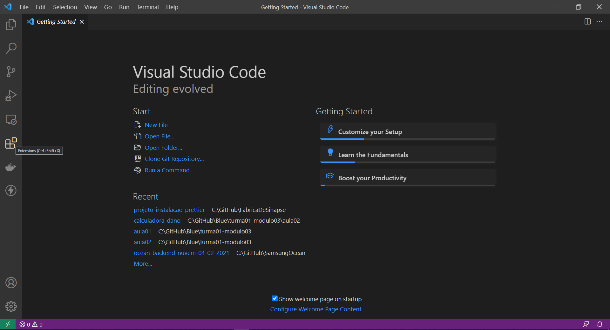
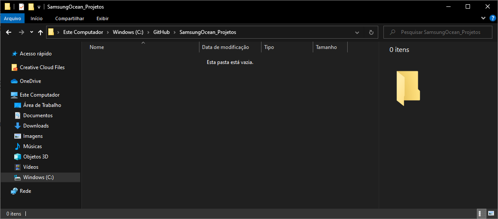
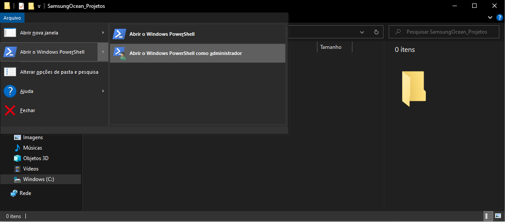
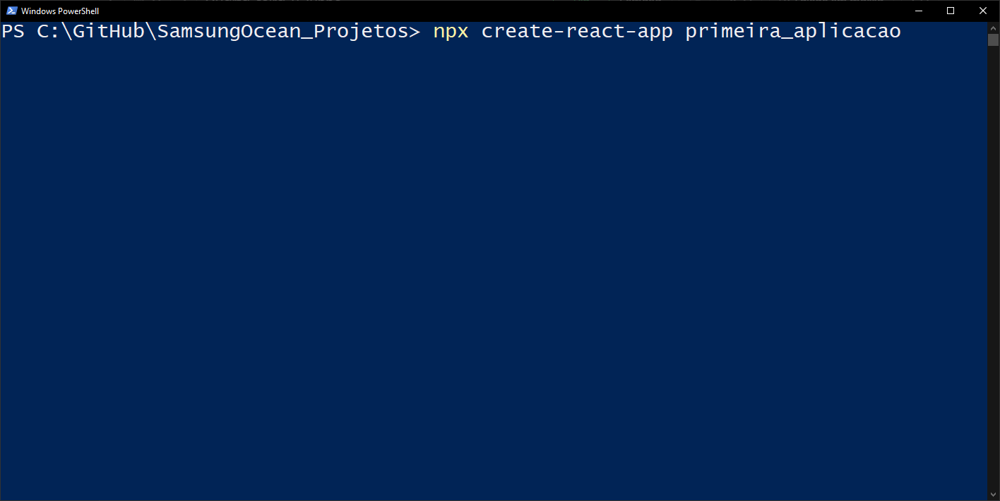
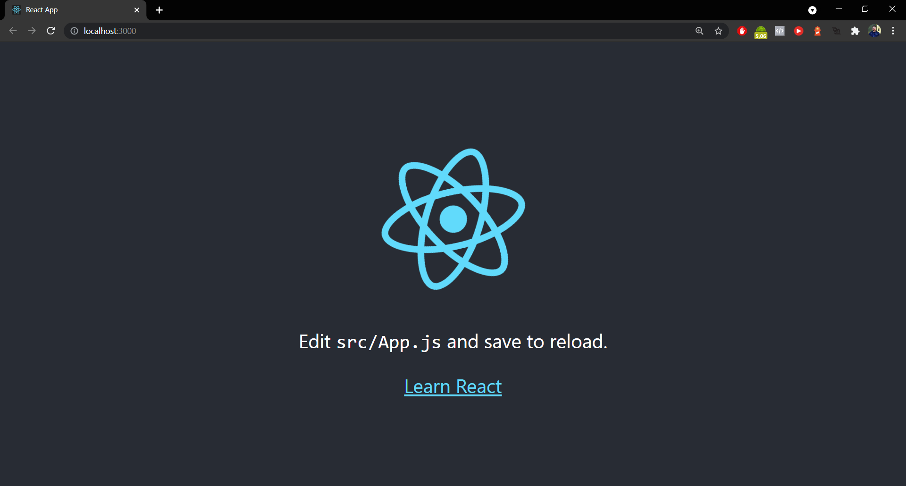

# Samsung Ocean - Trilha Frontend: Preparação

Para participar os cursos da trilha de frontend do Samsung Ocean você precisa instalar o software NodeJS e o editor de códigos Visual Studio Code.

## NodeJS

Acesse o site do NodeJS e faça o download da versão LTS mais atualizada e que corresponda ao seu sistema operacional.

https://nodejs.org/en/download/

Faça a instalação do software seguindo as opções padrão.

Caso você esteja no Windows, o software `npm` (node package manager) também será instalado.

Caso você esteja no Linux, pode ser necessário instalar o `npm` separadamente.

## Visual Studio Code

Faça o download do VSCode em https://code.visualstudio.com/download.

Após instalar, abra o software e procure pelo botão `Extensions` no menu esquerdo.

Procure e instale a seguinte extensão:

- Prettier - Code formatted (Extension ID: esbenp.prettier-vscode)

# ReactJS

Com o NodeJS e o NPM instalados, a criação do primeiro projeto em ReactJS é muito simples.

Para começar, crie ou abra uma pasta em que seu projeto ficará localizado (essa não é a pasta do projeto ainda, uma vez que a pasta do projeto será criada dentro dessa pasta que você acabou de abrir).

Abra essa pasta com o terminal. Caso esteja no Windows, a forma mais simples é clicando em `Arquivo > Abrir o Windows PowerShell`. De preferência, abra-o como administrador.

Se estiver no Linux ou no Mac, clique com o direito na pasta e selecione a opção para abrir no terminal. No Windows essa opção está disponível caso você segure a tecla shift e clique com o botão direito na pasta.

No terminal, digite o seguinte comando: `npx create-react-app primeira_aplicacao`, sendo que você pode substituir `primeira_aplicacao` pelo nome que quiser.

Ao executar, isso criará uma pasta com os arquivos iniciais do seu projeto e instalar todos os pacotes necessários.

Para testar a aplicação, digite o comando `cd primeira_aplicacao`, sendo que você deve substituir `primeira_aplicacao` pelo nome que você colocou ao criar o projeto.

Após isso, digite `npm start` e pronto! Site rodando :)

## Conclusão

Pronto! Agora o NodeJS, NPM, Visual Studio Code e ReactJS estão devidamente instalados e configurados.

Se quiser se adiantar um pouquinho e começar a brincar com o NodeJS para testar se está tudo funcionando corretamente, procure por algum tutorial na internet mostrando como fazer a primeira aplicação com ReactJS, existem diversos conteúdos gratuitos que podem te ajudar a matar a vontade de aprender a desenvolver APIs enquanto o curso não chega.

É importante ter em mente que para a realização dos cursos do Ocean **não é necessário ter conhecimento prévio**, a menos que seja um curso muito específico que deixa isso bem claro nos **pré-requisitos**.